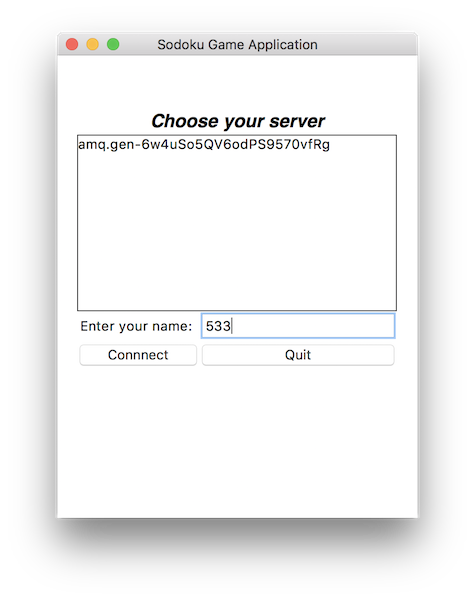
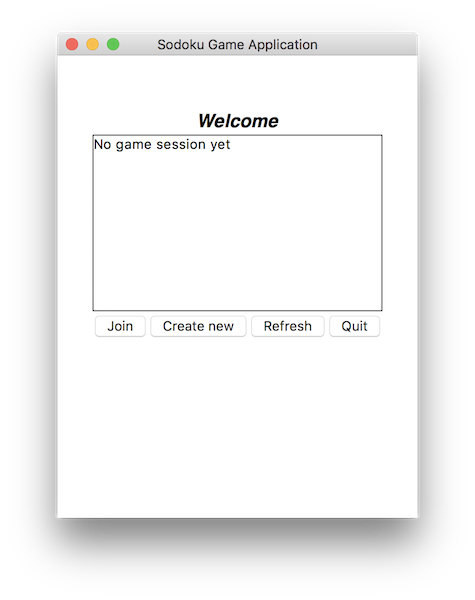
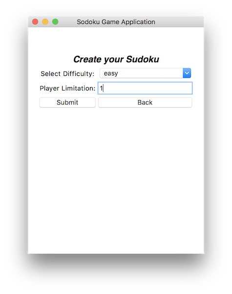
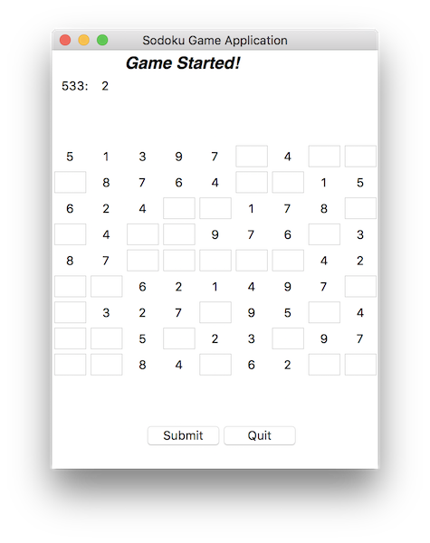

## Distributed Systems Homework 2
> Group member: `Andro Lominadze, Kadir Aktas, Xatia Kilanava, Shan Wu.`  
> Contents: [Requirements](#Requirements), [Run the Codes](#Run), [Architecture](#Architecture), [User Manual](#Manual).

#### I. Requirements 
* Tkinter -- Python UI Library
* rabbitmq -- Indirect communication & RPC
* pika -- used for rabbitmq
* set up system PATH for `rabbitmq-server`

#### II. Run the Codes 
* Open terminal: run `rabbitmq-server`
* ./server
    - run `server.py`
* ./client
    - run `client_UI.py`
* play with client

#### III. Architecture 

* The Rabbitmq provide us *indirect communication*. Each client or server will have a queue for storing messages, this queue will be in the broker, they check the broker if there is new messages. When clients and servers talk to each other, they put the message into the specific queue in broker, broker will keep the messages until someone who consume that queue take the message.
* Rabbitmq also provide the tutorial for *RPC* (shown in figure above). In this scenario, we require both client and server can send and receive, like a loop. Server may receive messages from different clients, so we need to identify each of messages. When client want to call remote objects from server, he will send a request with his own queue and a correlation id. This queue is for server to distinguish which client to reply and the correlation id is for client to check the response is related to which message. 
* We use *UDP multi-cast* for server detection. Server side just create a UDP socket for multi-cast each time, he will send message to specific multi-cast address. On client side, we also define a UPD socket to bind multi-cast address and listening all interfaces. Our multi-cast message is also a unique one. It consists of a specific header, a seperator and a payload (server queue). When client gets a message in multi-cast group, he will check header first. If header is correct, then append the server queue to self list, so client can get server list from it. 
* In our program, multi-cast emission and reception are running in background in a different thread. RPC and indirect communication are implemented by calling thread and other classes. 

##### Setup Process:
* Install rabbitmq , set system path
* Implement server, use rabbitmq RPC example, modify `on_request()` function.
* Create client UI
* Implement client communication part, use rabbitmq example, modify `call()` function and `on_response()`.
* Implement multi-cast server side and client side.
* Combine multi-cast with server main.
* Combine multi-cast and rabbitmq with UI.
* Test & Debug

#### IV. User Manual 

##### Server Selection

* In this window, user need to input a unique username and select a server to continue.
* Server list may take few seconds to detect, please wait patiently. (5-10 seconds)
* It will raise warning message box if you didn't input username or didn't select a server or username duplicated.

##### Game Selection

* In this window, user can choose either create a new game or join a game session. 
* Press refresh button to fetch latest game sessions.
* Press quit button to quit and log out.

##### Create Game

* In this window, user need to choose the difficulty of Sudoku and players number for the game. After submitted it, there will be a game window and waiting for opponents. 
* User also can press back button to select others' game sessions.

##### Game Session

* Game will start only when all players are joined. 
* User can select one empty entry to insert a number, if it's correct, score will be add by 1. If not, socre will be subtract by 1. 
* Press quit button to leave game session.

